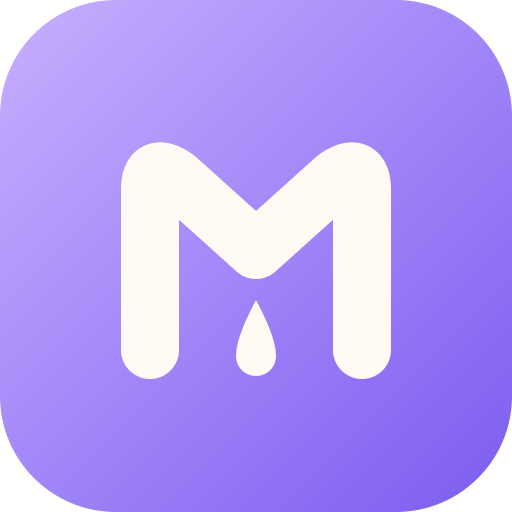
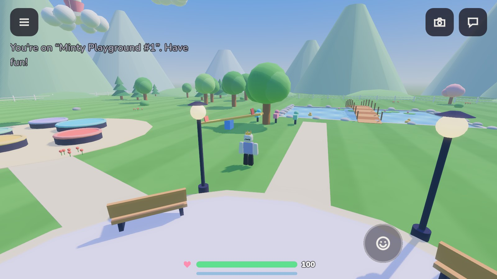
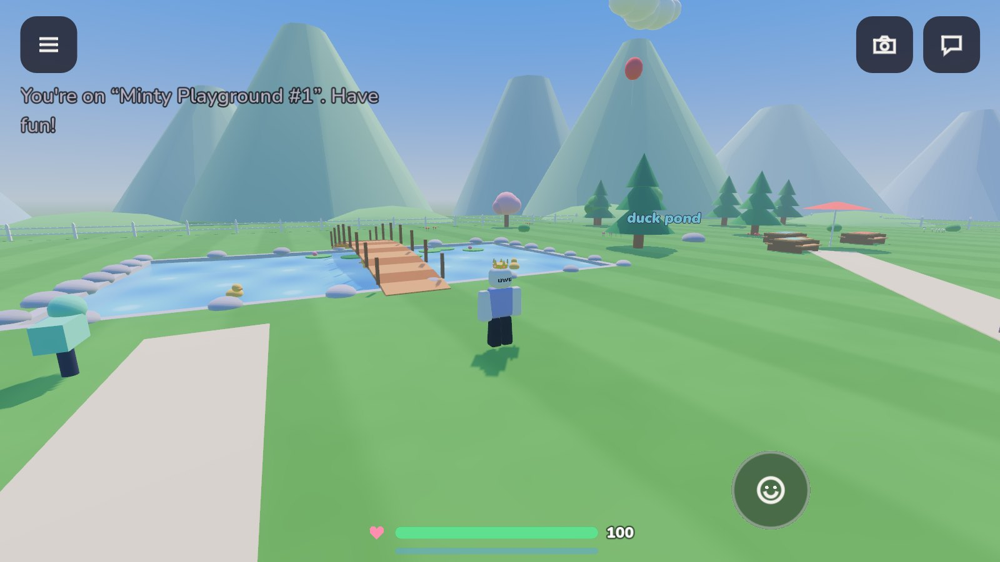
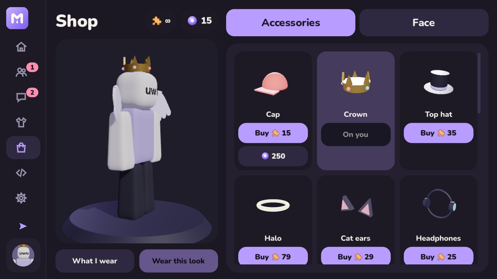
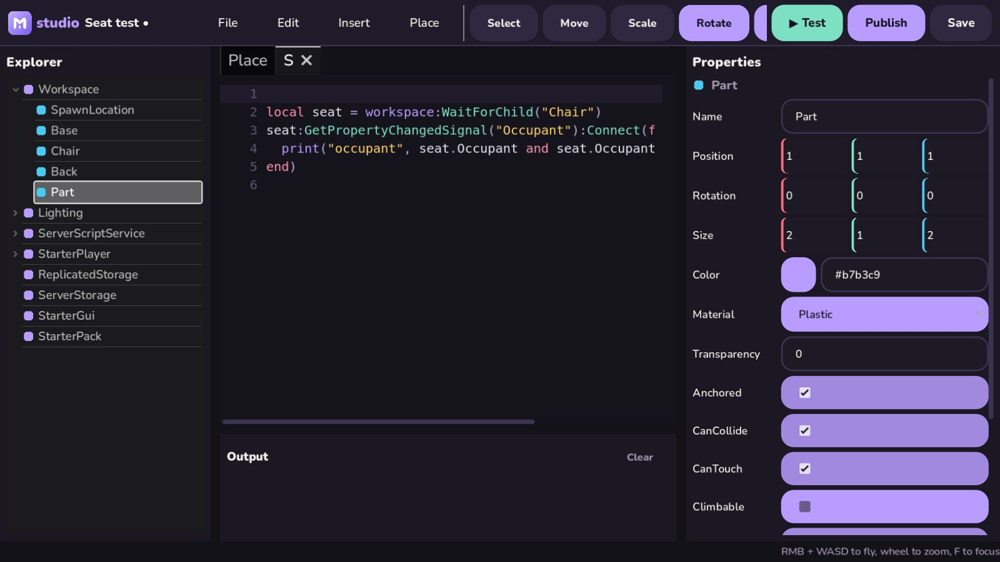
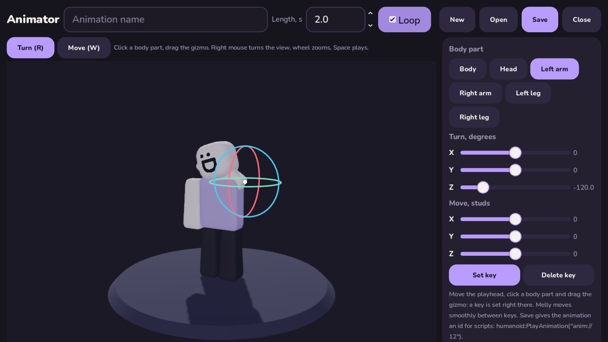
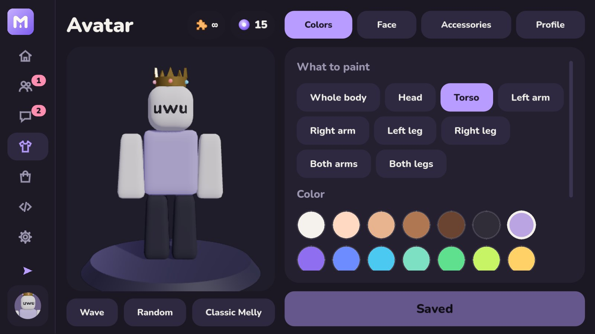
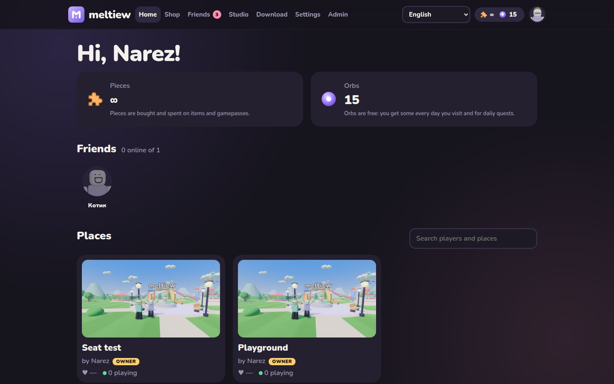
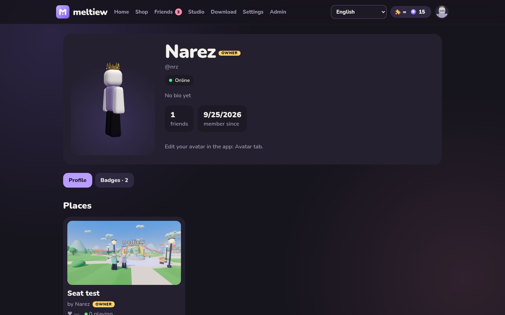

<div align="center">



# Meltiew

**A cozy multiplayer sandbox: play, dress up your Melly, build your own worlds.**

[](https://meltiew.narez.xyz)
[](https://t.me/meltiew)
[](https://github.com/narezy/Meltiew/tree/download)




</div>

## Get it

| | |
|---|---|
| **Android** | [meltiew.apk](https://github.com/narezy/Meltiew/raw/download/meltiew.apk) |
| **Windows** | [meltiew-windows.zip](https://github.com/narezy/Meltiew/raw/download/meltiew-windows.zip) |
| **Linux** | [meltiew-linux.zip](https://github.com/narezy/Meltiew/raw/download/meltiew-linux.zip) |
| **Browser** | profiles, places, shop and more on [meltiew.narez.xyz](https://meltiew.narez.xyz) |

News, sneak peeks and chatting live in [**@meltiew**](https://t.me/meltiew).

## Screenshots

<table>
  <tr>
    <td></td>
    <td></td>
  </tr>
  <tr>
    <td></td>
    <td></td>
  </tr>
</table>

<details>
<summary><b>More screenshots</b></summary>
<br>

| Avatar editor | Website |
|---|---|
|  |  |
| **Profile on the web** | |
|  | |

</details>

## What's inside

<details>
<summary><b>Play</b></summary>

- Multiplayer places, up to 10 players per server, friends join friends
- Chat with bubbles, emote wheel, sprint with stamina, climbing, seats
- Phone controls (joystick, touch camera, pinch zoom) and PC controls (WASD, mouse, shift lock on Ctrl)
- Badges you earn in places and show off on your profile

</details>

<details>
<summary><b>Melly & shop</b></summary>

- Paint every body part, pick a face, stack accessories
- Shop with try-on: pay with **pieces** or free **orbs** (daily visits and quests)
- 3D avatar on your web profile

</details>

<details>
<summary><b>Studio</b></summary>

- Build places right in the app: parts, lighting, UI, sounds, seats, tools
- Script them in **Luau** with a Roblox-like API (Humanoid, Camera, DataStores, gamepasses, badges...)
- Animator with gizmos: click a body part, turn and move it, save, play it from scripts
- Publish in one click, then edit the page, covers and translations on the site

Docs: [meltiew.narez.xyz/docs/studio](https://meltiew.narez.xyz/docs/studio)

</details>

<details>
<summary><b>Social</b></summary>

- Friends, requests, direct messages, blocks, reports
- English and Russian everywhere
- Admin panel for moderators

</details>

## For developers

<details>
<summary><b>Repo layout</b></summary>

```
client/    Godot 4.7 app (Android, Windows, Linux)
server/    Node.js: REST API, WebSocket game servers, Luau VM, SQLite, website
deploy/    one-command VPS installer (systemd + nginx + Let's Encrypt)
tools/     generators for docs, accessories and runtime sync
branding/  logo and icon sources
```

</details>

<details>
<summary><b>Run the server</b></summary>

```bash
cd server && npm ci && npm start   # http://127.0.0.1:7350
npm test
```

On a VPS (Ubuntu + nginx, as root). Running it again updates the code and keeps the database:

```bash
curl -fsSL https://raw.githubusercontent.com/narezy/Meltiew/main/deploy/install.sh | bash
```

Logs: `journalctl -u meltiew -f`

</details>

<details>
<summary><b>Build the app</b></summary>

Open `client/` in Godot 4.7.2. Point it at a local server with `-- --server=http://127.0.0.1:7350`.

```bash
# Android (needs Android SDK + JDK 17; the signing key stays outside the repo)
GODOT=godot KEYSTORE=/path/release.keystore KEYSTORE_PASS=... client/build_android.sh

# Desktop, from client/
godot --headless --export-release "Windows" export/windows/Meltiew.exe
godot --headless --export-release "Linux"   export/linux/Meltiew.x86_64
```

New release: bump `LATEST_CLIENT` in `server/src/version.js` and older apps will ask to update.

</details>

## Contributors

<a href="https://github.com/narezy"></a>

**[@narezy](https://github.com/narezy)**: creator, ideas, design, testing, everything Meltiew

<div align="center">
<sub>Made with love and a lot of Mellies</sub>
</div>
